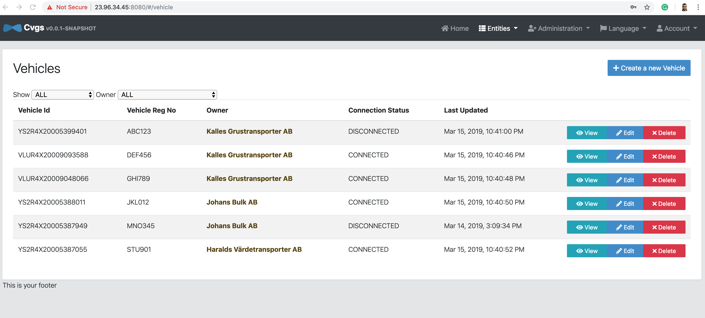

# Connected Vehicles

## Project description

Connected Vehicles is a system for managing and monitoring vehicles 

System consists of three main microservices:

1. Connected Vehicles Gateway service    [CVGS](https://github.com/ahmedmeid/cvgs)
2. Customer Management service           [CMS](https://github.com/ahmedmeid/cms)
3. Vehicles Data service                 [VDS](https://github.com/ahmedmeid/vds)

Full solution description can be found in [Solution Blueprint document](SolutionBlueprint.md)

## Features

* Showing vehicles connection status in near real time through websockets technology.
* Localization: English, and Swedish.
* Receiving vehicle data: GPS location, speed, fuel level, ..etc. and storing it in system database.
* Security using credentials.

## Screenshot




## Running solution on a local machine in dev mode

### Requirements

* Java 8
* Maven
* Nodejs
* Angular CLI 
* Docker : for getting MQTT broker and MongoDB instances
* Python 3 : for running vehicle data adapter and vehicles simulator


### Steps

Clone main project repository

```
git clone https://github.com/ahmedmeid/connected-vehicles
```

Clone JHipster registry repository

```
https://github.com/jhipster/jhipster-registry.git
```

Clone Gateway service repository

```
git clone https://github.com/ahmedmeid/cvgs
```

Clone Customer Management service repository

```
git clone https://github.com/ahmedmeid/cms
```

Clone Vehicle Data service repository

```
git clone https://github.com/ahmedmeid/vds
```

Run registry


```
cd jhipster-registry
./mvnw
```

run mqtt broker

```
docker pull eclipse-mosquitto
docker run -d -p 1833 --name mosquitto-instance eclipse-mosquitto
```


Run gateway service


```
cd cvgs
./mvnw
```

run customer management service


```
cd cvgs
./mvnw
```

Start mongodb

```
docker pull mongo
docker run -d -p 27017:27017 --name mongo-instance mongo
```


Run vehicle data management service


```
cd vds
./mvnw
```

Open the application url in the browser: [http://localhost:8080](http://localhost:8080)

Start the vehicle data adapter


```
cd connected-vehicles/vehicles-data-adapter
python3 vehicles_data_adapter.py
```


Start the vehicles simulator
```
cd connected-vehicles/vehicles-simulator
./start_simualtors.sh
```

### API documentation

API documentation can be accessed at the web interface under Administration -> API


## Deployment on cloud

#### Requirements

In addition to build requirements, the following tools are required:

1. Docker: Container management suite.
2. kubectl: The command line tool to interact with Kubernetes. Install and configure it.
3. Azure CLI: The command line tool to interact with Azure. Install and log in with your Azure account(You can create a free account if you don't have one already).

#### Steps

Build docker images

```
cd cvgs
./mvnw package -Pprod verify jib:dockerBuild

cd ../cms
./mvnw package -Pprod verify jib:dockerBuild

cd ../vds
./mvnw package -Pprod verify jib:dockerBuild
```

Push docker images to docker hub

```
docker image tag cvgs <docker_account_id>/cvgs
docker push ahmedeidx/cvgs

docker image tag cms <docker_account_id>/cms
docker push ahmedeidx/cms

docker image tag vds <docker_account_id>/vds
docker push ahmedeidx/vds
```

Login to your Microsoft Azure account

```
az login
az group create --name connectedVehicles --location eastus
```

Create a resource group

```
az aks create --resource-group connectedVehicles --name connectedVehicles \
--node-count 2 --enable-addons monitoring --generate-ssh-keys
```
Configure kubectl

```
az aks get-credentials --resource-group connectedVehicles --name connectedVehicles
```

Clone Kubernetes configuration repository

```
git clone https://github.com/ahmedmeid/k8s.git
```

Modify the following line in the yaml configuration files:

```
        image: ahmedeidx/<cvgs/cms/vds>
```
replace ```ahmedeidx``` with your docker account name that you have used to push docker images

Apply projects

```
cd k8s
kubectl apply -f registry
kubectl apply -f cvgs
kubectl apply -f cms
kubectl apply -f vds
```
