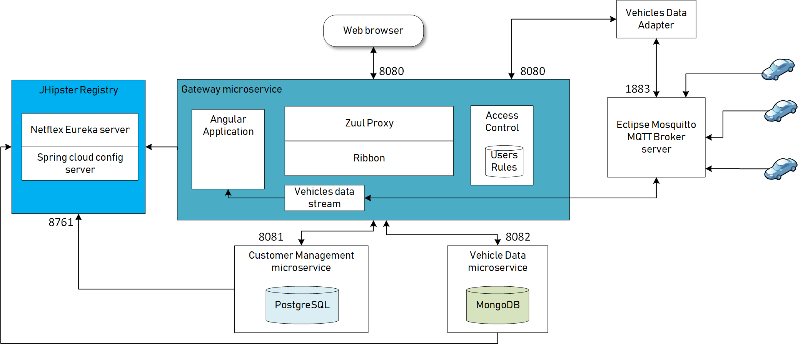
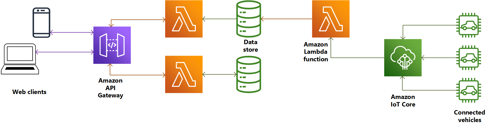

# Connected Vehicles Solution

This solution has been designed and implemented in response to [challenge](alten-challenge.md) for candidates for consultant positions within ALTEN Sweden.

## Assumptions
	
* Vehicles are equipped with Internet-connected telemetry that reports vehicle events recorded during each trip.
* The vehicle devices can communicate using MQTT, an industry-standard communications protocol.
* Data set includes vehicle speed, fuel level, GPS location, and exceptional events.
* Data is sent to back end service once per minute.
* Communication is two-way between the telemetry devices, because they both supply data and can accept messages.
* Bidirectional communication with the vehicle devices can be used in many ways. Examples include to request data that hasn't yet been uploaded, or to provide configuration updates for the device such as the types of events and data to report.
* Back End service detects vehicle device disconnection event and reports status to vehicle tracking service, then it tries to ping disconnected vehicle using MQTT message.
* Vehicle data is aggregated and then combined with corporate data about the vehicle and customer for further analytics.
* Proposed solution implementation does not have encryption for communication between devices and back end services, on production environments an encryption technique should be used.
* Test data filled in the initial setup of the system and generated by car device simulator is for demonstration purpose only.
* Vehicle id and vehicle registration number are unique values.

## Solution Architecture

## Solution Description

Solution Design follows the proxy microservice pattern in which there is an aggregator/proxy in front of the services, which acts as the gateway for the end users. The gateway microservice handles all the user requests and the individual services that talk via the gateway to the users.

#### Gateway microservice

Gateway microservice incorporates the following components:

##### Angular Application
Angular Application is a web application developed using Angular MVVC Single Page Application Framework by Google. It provides a GUI for the user to register customer and vehicle information, and view the connection status received from Vehicle data stream through websocket in near real time.

##### Zuul Proxy
[Netflex Zuul Proxy](https://github.com/Netflix/zuul) is a front door for all the requests (gatekeeper). It acts as an edge service application. Zuul is built to enable dynamic routing, monitoring, resiliency, and security among the services. It also has the ability to dynamically route requests as needed.

##### Ribbon

[Hystrix Ribbon](https://github.com/Netflix/Hystrix) is a latency and fault tolerance library designed to isolate points of access to remote systems, services, and third-party libraries, stop cascading failures; and enable resilience in complex distributed systems where failure is inevitable.

##### Vehicle Data Stream

Vehicle Data Stream is a spring integration stream with inbound adapter for MQTT and Websocket container outbound adapter. It consumes messages from MQTT broker server and publishes it through websocket.

##### Vehicle Data Adapter

Vehicle Data Adapter is a Python application that consumes MQTT messages and calls REST API's through API gateway to update vehicle data microservice with the vehicle connection status and 

#### JHipster Registry

##### Netflex Eureka server
[Eureka](https://github.com/Netflix/eureka) consists of the following:

The Eureka server

Eureka is a REST-based service. It is used for locating services for load balancing and failover middle tiers. 

Eureka servers help to load balance among the instances. They are more useful in a cloud-based environment where the availability is intermittent. On the other hand, traditional load balancers help in load balancing the traffic between known and fixed instances.

The Eureka client

Eureka provides a Eureka client, which makes the interaction between servers seamless. It is a Java-based client.

Eureka acts as a middle tier load balancer that helps to load balance the host of a middle-tier services. They provide a simple round robin-based load balancing by default. The load balancing algorithm can be customized as needed with a wrapper.”

##### Spring Cloud Config server

[Spring cloud config server](https://github.com/spring-cloud/spring-cloud-config) provides server and client-side support for external configuration.

With the cloud config server, we have a central place to manage all our external properties across all environments. The concept is similar to Spring-based environment property source abstractions on both client and server. They fit for any application running in any language.”

#### Customer Management microservice
Customer Management micoservice stores customers and vehicles information in a PostgreSQL database and provides set of REST API's for registering and retrieving it.

#### Vehicle Data microservice

Vehicle Data microservice stores vehicle data received from vehicle devices in MongoDB NoSQL database. Mongo is suitable for heavy writing and big data applications.
Data from this microservice can be imported for further analysis and reports generation

### Alternate Solution (Serverless Architecture)

An alternative solution is Serverless Architecture using AWS 

Connected vehicles will send data to Amazon IoT platform, and solution will be implemented as Amazon Lambda functions to receive data and store it in data store, and another Lambda function to serve vehicle data and a third one to serve customer data.

Web clients will access the system API's through Amazon API Gateway.

